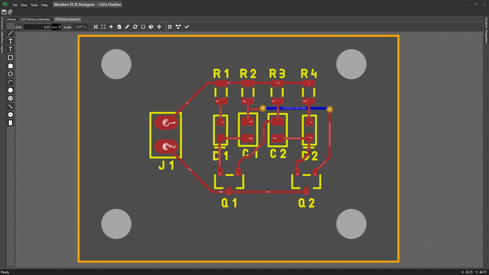
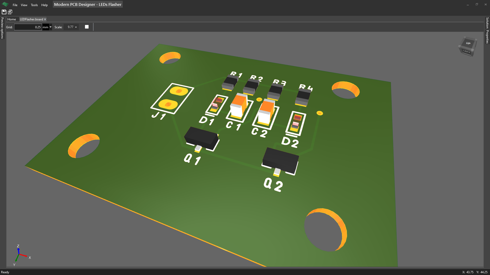

# Creating the board

It will be a 2 layer board and will look similar to a breakout board. Breakout boards are usually used for testing a circuit or for fast prototyping.

In **Solution** tool window, right click on Boards folder and then choose **Add-> Board...** from context menu. Give the board a name in the dialog that appears and then click **OK**.

## Reference the schematic for your board

We must link our board to a schematic.

Click on **Set reference schematic** and select the schematic in the dialog that appears then click **OK**.

## Creating the board outline

The board outline define the shape of the board. In the **Layers** window, there is a layer called **Board Outline**. Select this layer. There are some lines that already define a default board outline. Delete all these lines. We will draw our own outline.

Just place on this layer **Board Outline** lines and arcs only so that it will form a close loop. 

It is important to have a closed loop. When you finished, click on **Update board outline** from the top bar. 

The shape of the board must update with the new one; just in case it doesn't, check that you have items that start in the same point of another item that ends.
 
I would recommend placing any mounting holes that would be needed, now, before placing the components. If you place the holes later, you will have to move the components and maybe redo some routing. This could be a pain.

## Placing components on the board

You can place the components on the board by simply selecting them and dragging them where you want them to. You can rotate them with **[SPACE]** key.

To see the relation of one pad with another, you can press **[SHIFT]** and select a pad. This will highlight the entire net with all the pads that must be connected, and the board will get dimmed.

You can move the components and the net will stay highlighted during this time.

If you are interested in a particular net, or in particular components, remember that there is this cool feature of cross-highlight and cross-select between schematic and the board. In your schematic, you may select a part and you may highlight a net (by SHIFT and select a pin, for example). This will also select the part in the board and will also highlight the net; now you may position the parts on the board easier.

## Creating board rules

We will have something simple, some clearance and some minimum width for our traces.

Click on **Properties** in the top bar and then on **Rules**. 

Notice that there are some already defined rules. 

You add a rule by using the toolbox from the left. There is a button for every rule type that is supported. You can also group all these rules.

We will explain all these rules in more depth in another article, but for now define these rules: **Electrical clearance**, and **Trace width**. Set 10 mil as clearance and 10 mil as min trace width.

When you finished, click on **Show Board**

## Routing the board

Routing the board is the process of making all the connections between the pads.

Click on the **Track** in the toolbox from the left side.

Click on the pad from where you want to start. Now you have some options to change the style of the routing (direct, horizontal-diagonal, or diagonal-horizontal) by pressing **[SPACEBAR]** key. This refers to the orientation of the lines that will go from the last point you clicked and the position of the mouse. You can also control the routing mode with **[TAB]** key. This is about how the router will behave in relation with the obstacles.

Finally, click on the second pad to finish the routing of that trace. You can also change the layer by selecting another layer in the **Layers** tool window. 

Repeat until you finish routing the board.

**Image of the finished board**

**Image of the finished board 3D preview**

