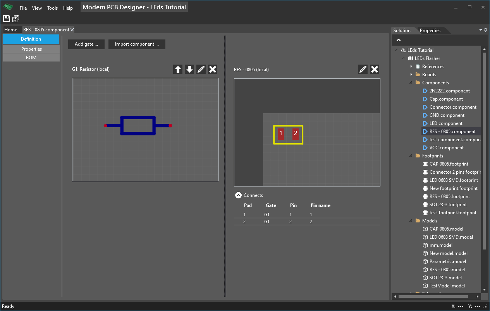

# Creating a new component (Resistor)

A component links pins from the symbol with pads from the footprint; here you can also define the prefix, custom properties, and BOM data.

Right-click in **Solution** tool window on **Components** folder then **Add->Component...**  from context menu, choose the name for the component and click **OK**.

On the left we have the area where we add symbols as gates. You can add multiple symbols that will make up the gates for that component.

To explain what a gate is, think about a quad opamp that has four opamp gates (quad) and other pins for power of the device. In defining such a device you would add maybe five symbols (gates): four for every opamp gate, and another for V+ and V-.

So, in order to add a gate we need to click **Add gate**, then select the resistor symbol you defined previously from the dialog that appears then click OK.

Click on **Change footprint** and select the resistor footprint you defined earlier from the dialog window and click OK.

Under the footprint, notice there is a grid that specifies what pin from the symbol connects with what pad from the footprint. In our case for our resistor it is not important, just check that is not specified the same pin for two different pads.

Click on **Properties** and specify a prefix, in our case type ***R***, and specify some properties for this component, for example you can specify the value, power, tolerance and others.

**Here is the finished component**

