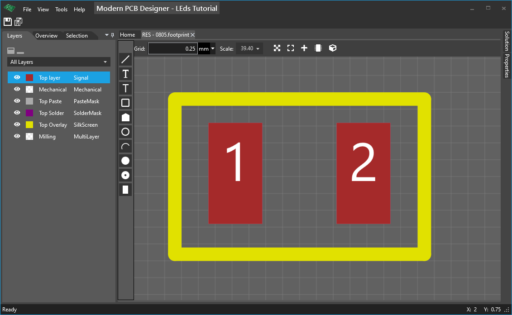
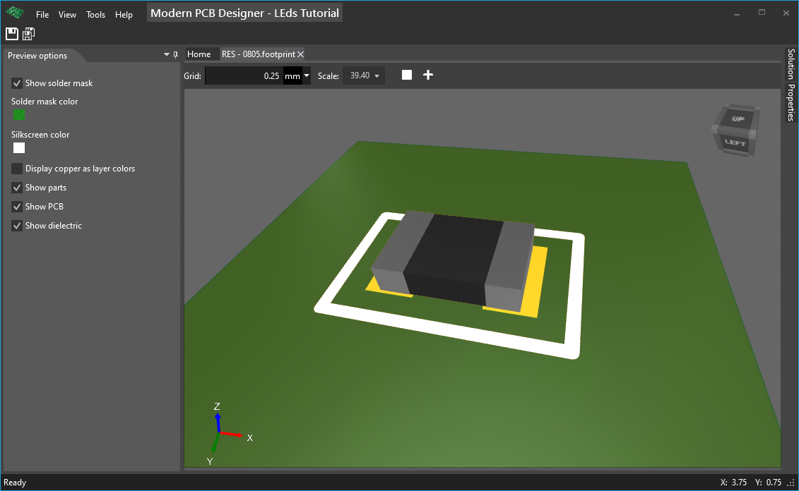

# Creating a new footprint (Resistor)

In the **Solution** tool window, right click on the folder **Footprints** and choose **Add -> Footprint** from the context menu. 

We'll create the footprint for a resistor that has the size 0805, which is a SMD package.

## Overview
Here is what you should consider when you design any footprint:

- Use the internet for the most common sizes; in our case we will google for *0805 res footprint size*, or something similar.
- Use a similar footprint that was designed previously. This could be from another project that was made either by you or somebody else
- Use the datasheet of the part you want to use. In the datasheet you will find a section that reads something like *Recommended landing pattern* or similar. If not, estimate some pad sizes that you will take from the dimensions that are describing the part, print the board on the paper (see below) and check the fitting, and repeat as needed.
- Remember the following rule: **ALWAYS verify your footprint**. If you've taken for granted the footprint sizes, it will most likely not fit for you; for example you won't be able to solder the part, or the part will just not fit on the footprint. You can do this verification even from early stages when you created the board, by just printing on paper this board that contains these parts, and then physically take out the part from your parts bin or from the cut-tape and check if it fits on this printed paper, and if you can solder it, if your soldering iron can reach the pads, and so on.

## Create resistor footprint

In the toolbox on the left click **Smd**, to create a SMD pad and then click on the canvas to position and create two smd pads.

Select the two pads and set Width and Height properties for both pads at the same time. 

Position every pad by changing X and Y properties. X and Y properties for a smd pad represents the center of the rectangle that defines the pad.

You can also drag the pads to move them, but changing properties in **Properties** tool window is more precise.

In the **Layers** window choose **Top Silkscreen** layer. In the toolbox, click on **Line** and click multiple times to define the placement outline for our resistor. To define the outline, take into account the mechanical dimensions of the resistor from the datasheet, or having the part in your hand (or on the desk), use a calliper and measure it.

One final check: make sure you have two pads that are numbered differently: **Pad 1** and **Pad 2**; you may check this in **Overview**.

**Picture with the finished resistor footprint**

## Associate the 3D model

Show 3D view by clicking the **3D preview** button from the top bar.

You need to create a model first. 

Click on **Associate 3D model ...**, in the dialog that appears, choose the model, then click **OK**. 

The model should be self-aligned on the pads if you defined the pad numbers on the boxes in the model as described previously. 

If the model is not aligned, then select the model, and change X, Y, Z properties for the center position, and RotationX, RotationY, RotationZ properties for the orientation of the model.

**Picture with the asociated model**

