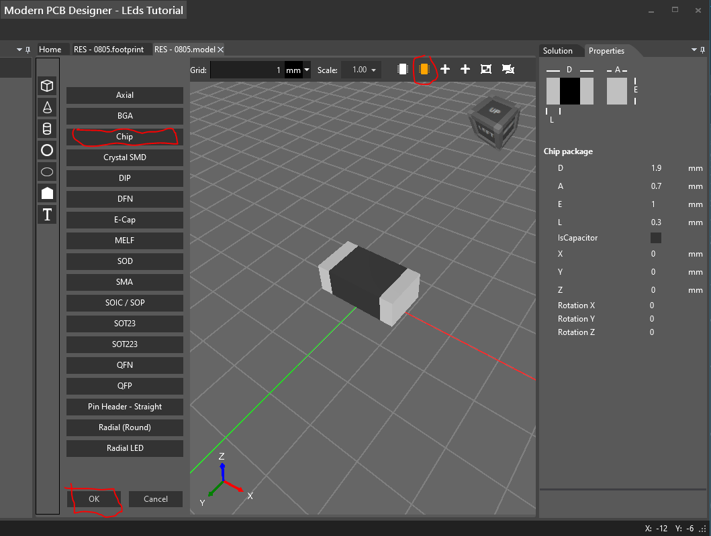

# Creating a new model (Resistor)

In **Solution** tool window, right-click on **Models** folder and choose **Add->Model...** from context menu. 

In the window that appears, type the name for the model and then click OK.

On the top-bar click on **Define the model using parameters** (the orange button).

Click on **Chip** then click **OK**

Select the chip resistor and in **Properties** tool window specify the dimensions as below

