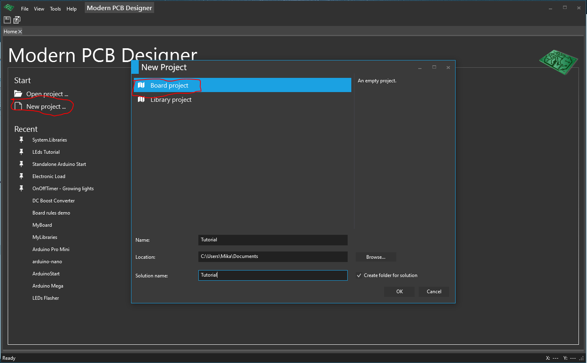

# Creating a new project

Open XNoCAD
 
Click on **New Project**, choose the **Board** as project type, type the name for the project, then click OK.

In the **Solution** tool window, notice the tree structure. At the root we have the solution. A solution is the collection of your projects, your architecture that you create for your product.

Picture with solution tool window

In this turorial we'll use a single project.

Although you will usually use external libraries for components, we will create components, footprints, symbols, and models right in the same board project, just for the purpose to demonstrate this feature.

So, in this project, create a few folders to stay organized. 

Create the following folders, by right-clicking on the project in **Solution** tool window and choose **Add-> New Folder** from context menu:
- Symbols
-  Footprints
-  Models 
-  Components
-  Schematics
-  Boards.
 
You don't really have to create these folders, you may choose not to create them, and the folder name is not important. 

You may name any folder whatever you want.