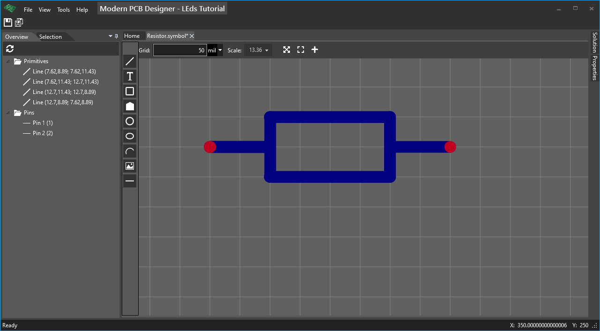

# Creating a new symbol (Resistor)

In the **Solution** tool window, select the **Symbols** folder and right-click and choose **Add-> Symbol...**, in the window that appears choose the name for the symbol: **Resistor** and click OK.

## About canvas

Having the symbol you created open, you can see the canvas where you can design your symbol. The canvas I am describing is similar for either a footprint, a schematic or a board.
On the top, there is the toolbar where you can change the grid size and units (mil or mm). On the left you will find the toolbox where you find primitives that will create your symbol. You can zoom by using the mouse wheel, you can pan by moving the mouse while clicking and holding the middle mouse button.

## Create resistor symbol

In the toolbox on the left click on **Pin**. 

A pin will be shown that will move while you are moving the mouse. Press the [SPACE] key to rotate the pin, then click anywhere on canvas to place it.

Place the second pin. 

Click on **Line** in the toolbar, and click multiple times on the canvas to define the lines that will make up the resistor symbol.

Right-click to exit the placing mode. You may need to right-click multiple times.

When you have a symbol open you should have two more tool windows open: **Overview** and **Properties**.

**Overview** shows primitives and pins from this symbol document. 

When you select a primitive in **Overview**, it will be selected in the canvas as well; it also works the other way: when you select a primitive in the canvas, by clicking on it, or dragging a rectangle around it, it will be also selected in **Overview**. 

When a primitive is selected, its properties will be shown in **Properties** tool window.

When multiple items are selected, in **Properties** will show the common properties of these selected items so that you can change all selected items at once. For example, you choose to select all the lines you created previously and change their color.

One more check: make sure the pins that are defined have **Number** property different: 1 and 2; you may use **Overview** for this and you should see two pins: **Pin 1** and **Pin 2**.

Save the symbol.

**Picture with the finished resistor symbol**

