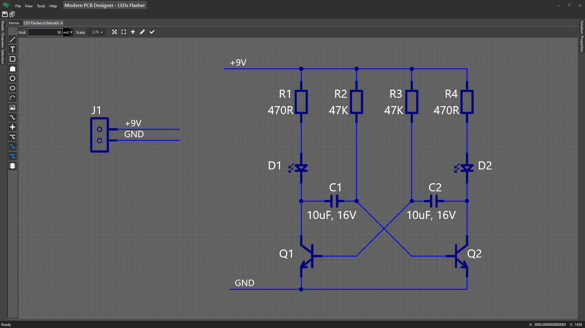

# About Modern PCB Designer

In this tutorial we'll build a popular circuit, which is a two transistor LED flasher.

It is a circuit with two LEDs that will blink/flash in turn.

This will get you started in designing a PCB from start to finish step-by-step.

We'll create the schematic, components with their footprints and 3D models.

We'll then route the board, assign board rules and finally, create output in gerber file format with the purpose of manufacturing, and what to take into account when sending your board for manufacturing.

**Some usage for this circuit:**
- Signal by flashing that a battery level is low or high
- Replacer of a LED or relay with this circuit to indicate a condition: you need to water plants, someone is in your house, etc

**Image of the finished schematic**

**Image of the finished board**

**Image of the finished board 3D preview**

